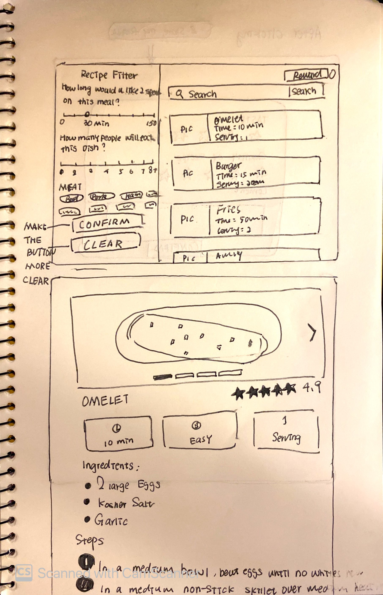
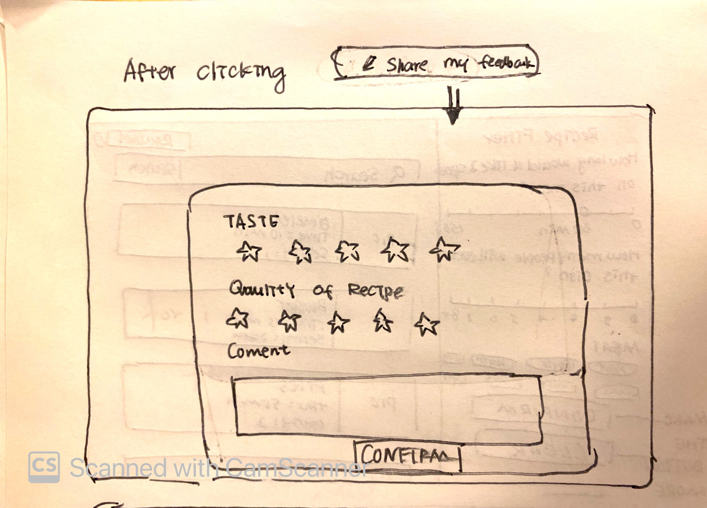

# Evaluation:
### Key Takeaways:
* Users want a visually appealing and intuitive user interface
* Users are confusing with the meaning of servings, a rewording might be needed
* Pictures in the recipe pages are not easy-to-read and they intuitively thought the image could swipe to change which they cannot.
* Users are not able to back to the last step or back to home page
* The readability and interactivity of the text about steps is poor
* Users want more information about rating: Is the rating about the taste or quality of the recipe?
* Users want to know how many people give the rating.
* The entrance of rewards is confusing: users would regard the reward button as the entrance, but the access is the profile icon. 
* Some users will not choose a specific time instead of a specific time like 23 min
* Users do not see the “Confirm” and “Clear” buttons. They are not intuitive and people need to scroll down to see them.

### Participants 1: Male 26
Assume you are the lawyer who enjoys cooking in his own place but has a tight time schedule this semester. You have a meeting scheduled at 8 pm, and would like to make a quick dinner using some available ingredients so that you can save your time.  
Now, you are trying to figure out how to play and learn in the app. ( Onboarding tutorial experience) During the exploration, you can continue thinking out loud — that is, simply verbalizing your thoughts as they move through the user interface. Now you can start to explore the app. 

Notes: Assume I have egg which is one of my fav food. Oh, I get the omelet and Fries. Never thought the fired could contain eggs. Interesting.
10 min is a nice time, I’ll just click on it to see what happened.
Oh, what happened to the picture? I can’t see the pic clearly. I get used to wide and clear pictures to show all the details. Oh, I can not swipe to change the pic, right? That’s a bit confusing. I guess it can only be controlled by click. (Didn’t find the arrow). The steps are not clear to me. Since it contains too much text and the text is small. They are not easy to read. I’d prefer a more interactive, more vivid presentation of the steps. Okay, now I’d like to come back. Oh, wait, how can I come back??? I guess there should be a button to come back to the last page.

Follow-Up Questions
How would you rate the overall experience from 1 to 10? What do you like about it? What do you dislike about it?  
5. The idea is great but it’s not fully functional. Also, the UI design is not appealing.

Assume you are a food-science student at Cornell University and she loves to explore new recipes. She cooks nearly every day, and she cares about the taste of the meal. You now want to explore the variety of recipes based on her ingredient keywords input. 
Now, you are trying to figure out how to play and learn in the app. ( Onboarding tutorial experience) During the exploration, you can continue thinking out loud — that is, simply verbalizing your thoughts as they move through the user interface. Now you can start to explore the app. 
Since I personally cook every day, I can imagine what her needs would be like. Ok, I’ll first click several ingredients. Oh okay, I guess I only have several choices. There is one thing that I’m thinking about is that I’d like to choose multiple ingredients to mix and match. If the app could help me to do that would be really helpful. I know it might be a bit difficult. I like that I can choose instead of the type which takes time and effort so that I won’t do it. But finding could be an issue as well. You know like when you have likE a crab or something is not common. hOW CNA I GER RECIPE WITHIN THESE KEYWORDS? As I talked about before, the steps are pointless and the text is plain and hard to read.
Follow-Up Questions
How would you rate the overall experience from 1 to 10? What do you like about it? What do you dislike about it? 
6 I like to choose but I have the same problem as mentioned before.

### Participants 2: Male 25
Assume you are the lawyer who enjoys cooking in his own place but has a tight time schedule this semester. You have a meeting scheduled at 8 pm, and would like to make a quick dinner using some available ingredients so that you can save your time.  
Now, you are trying to figure out how to play and learn in the app. ( Onboarding tutorial experience) During the exploration, you can continue thinking out loud — that is, simply verbalizing your thoughts as they move through the user interface. Now you can start to explore the app. 

Notes:
Since I am making a quick dinner, let me pick the fastest dish. Okay… Omelete takes 10 minutes, Fries takes 5, I am guessing that Fries will only require some potatoes and I think I have some, so let me check out the Fries. Oh, that’s weird, it looks like I have to use eggs to do the Fries and the picture does not look like Fries. Wait, is that because the Fries are actually using the information from Omelet? I think the app is using the incorrect receipt, but Omelet is also a good option, let me see what I need to do in order to make an Omelet. Okay… the ingredients part looks clear but I cannot see the picture clearly. 
Follow-Up Questions
How would you rate the overall experience from 1 to 10? What do you like about it? What do you dislike about it?  
4 as  i mentioned before

Assume you are a food-science student at Cornell University and she loves to explore new recipes. She cooks nearly every day, and she cares about the taste of the meal. You now want to explore the variety of recipes based on her ingredient keywords input. 
Now, you are trying to figure out how to play and learn in the app. ( Onboarding tutorial experience) During the exploration, you can continue thinking out loud — that is, simply verbalizing your thoughts as they move through the user interface. Now you can start to explore the app. 
Notes:
I mean the scale of the picture is strange, the thin display area blocks the bottom of the picture. Oh, I can click left and right to switch images, but the arrows are too unclear, I can barely see them. I feel that the text ratio is strange, I need to work hard to see what's inside the steps. I think instead of putting all steps into one page, creating a scrolling page might be a better option. By splitting steps into multiple pages, it can leave more space to display images and you can also map pictures with steps.

Follow-Up Questions
How would you rate the overall experience from 1 to 10? What do you like about it? What do you dislike about it? 
4

### Participants 3: Female 24
Assume you are the lawyer who enjoys cooking in his own place but has a tight time schedule this semester. You have a meeting scheduled at 8 pm, and would like to make a quick dinner using some available ingredients so that you can save your time.  
Now, you are trying to figure out how to play and learn in the app. ( Onboarding tutorial experience) During the exploration, you can continue thinking out loud — that is, simply verbalizing your thoughts as they move through the user interface. Now you can start to explore the app. 

Notes:
I was a little confused by the two sliders at the beginning that chose the time and number of people：Why is a slider? routinely I will not specifically go to choose 23 minutes. Choose as many as you can? No limit? That means if I choose several kinds of meat. Will there be multiple recipes recommended to me?

Follow-Up Questions
How would you rate the overall experience from 1 to 10? What do you like about it? What do you dislike about it?  
3 confusing for the most part. I guess it a nontraditional app so it takes time to 

Assume you are a food-science student at Cornell University and she loves to explore new recipes. She cooks nearly every day, and she cares about the taste of the meal. You now want to explore the variety of recipes based on her ingredient keywords input. 
Now, you are trying to figure out how to play and learn in the app. ( Onboarding tutorial experience) During the exploration, you can continue thinking out loud — that is, simply verbalizing your thoughts as they move through the user interface. Now you can start to explore the app. 
Notes:
Iguess i will know the combination of the foodwell. So I will choose my ingredient first. Ok. Then i THINKN I MIGHT TRied different thing since this is what i learn. I’m guesonig in this case it would be a bit difficult. Others thing would be the sam ea sthe last time

Follow-Up Questions
How would you rate the overall experience from 1 to 10? What do you like about it? What do you dislike about it? 
4 as i mentioned before
### Participants 4: Female 
Assume you are a lawyer who enjoys cooking in his own place but he has a tight time schedule this semester. He has a meeting scheduled at 8 pm, and he would like to make a quick dinner using some available ingredients so that he can save his time.  
Now, you are trying to figure out how to play and learn in the app. ( Onboarding tutorial experience) During the exploration, you can continue thinking out loud — that is, simply verbalizing your thoughts as they move through the user interface. Now you can start to explore the app. 

Notes:
The clear button is good but not clear enough. It’s not easy to be recognized. What does the serving mean? Will it recommend me with multiple meals at a time with different servings? Or just the amount of ingredients with different people. Not really clear about it. WHAT IS THIS? WHY I CAN ONLY SEE THE REWARD WHILE I’M CLICKING THE PROFILE. It is supposed related to the reward it self right. The rating cannot be clicked? Then why there is the thing while hoving. 

Follow-Up Questions
How would you rate the overall experience from 1 to 10? What do you like about it? What do you dislike about it?  
 4 not intuitive in most of cased

Assume you are a food-science student at Cornell University and she loves to explore new recipes. She cooks nearly every day, and she cares about the taste of the meal. You now want to explore the variety of recipes based on her ingredient keywords input. 
Now, you are trying to figure out how to play and learn in the app. ( Onboarding tutorial experience) During the exploration, you can continue thinking out loud — that is, simply verbalizing your thoughts as they move through the user interface. Now you can start to explore the app. 
Notes:
I like the rating system to enable me to choose whether it’s good or not. But the rating might be a little bit general since I do not know whether the rating is for the taste or the quality of the recipe. I guess it would be helpful if there is a detailed description or like a different rating? I don’t know. But I will think in this way. Idk. Ok  I’ll choose this one. Okay the pic is weird.eMMMMM. Okay. I guess the layout is a bit weird. The pic cannot be as a good reference. And the text is too small and recognized.

Follow-Up Questions
How would you rate the overall experience from 1 to 10? What do you like about it? What do you dislike about it? 
4 like the concept and dislike it . I mentioned before.

Revision:

## Design rationale:
* Based on the user testing, we refine and change our sketches based on user testing insights:
* We changed the rating system since users would like to know more about the rating. We add a rating for taste specifically and a rate for the quality of the recipe.
* Also, we made the button of confirming and clearing more eye-catching (make it pop up) since some users mentioned they didn’t notice the button.
* We enlarge the text size of the recipe details and enlarge the number in the recipe to how the variety of the text. In this case, users can notice the necessary information quickly. Plus, the reader can read text with more varieties to catch users’ eyes.
* As workflow changes, we change the entrance of the reward details to the reward button instead of the profile icon. This workflow is more intuitive.
* Besides, we have added scales to the slider, which could help users lock common/common numbers.
* We also changed the size of pictures into wider ones and made the content clear and straightforward since the most significant complaints about the design were the weird images.
* Since the serving is confusing, we reword it as “how many people will eat this dish” to show the serving means a serving for one dish.

