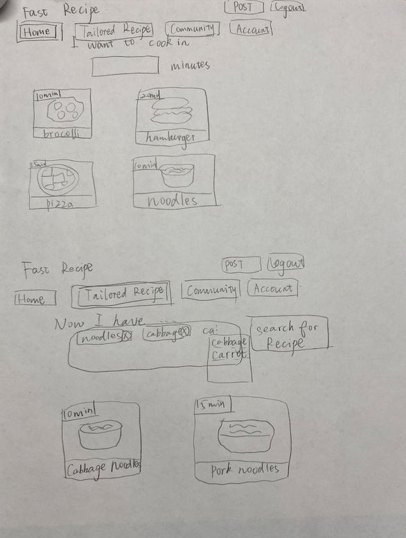
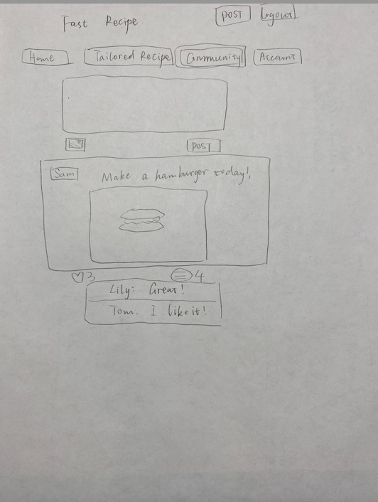
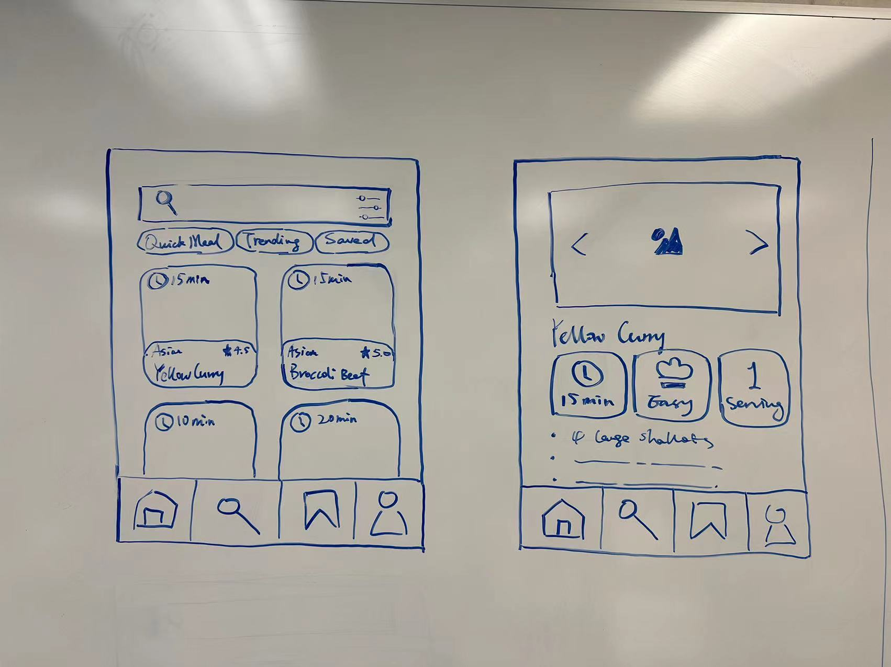
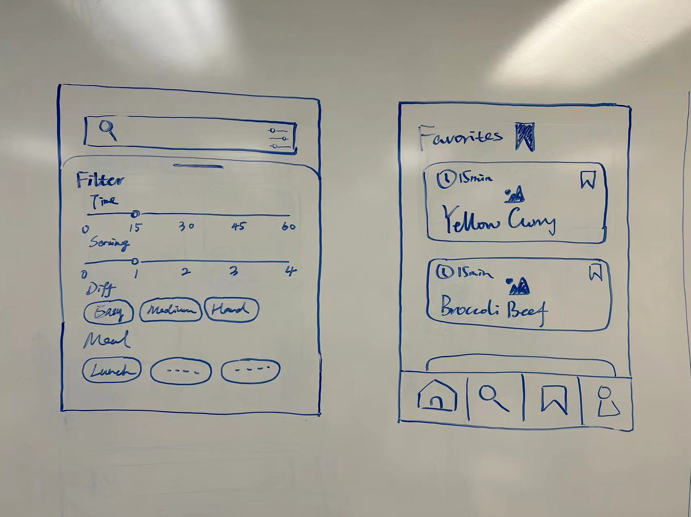
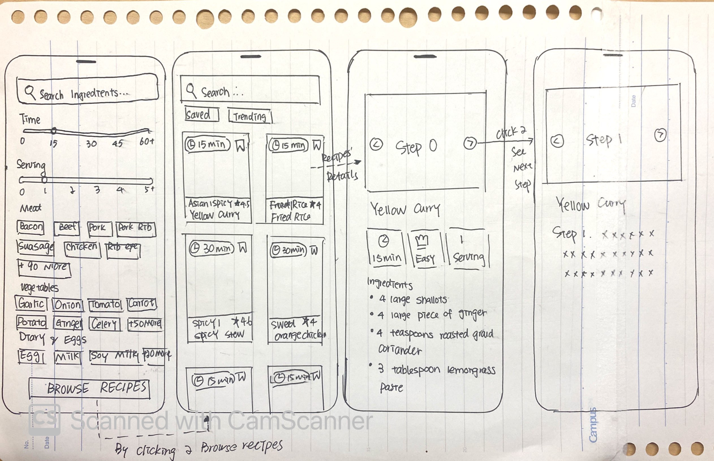

## Brainstorming and Sketches
Our team brainstrom using a whiteboard during the studio to list out the initial version of app features that we would like to include in our app.

These are the sketches of UI that each team member proposed based on user research. For example, user would like to make meal in a short period of time can use a slider to select the approximate time of the meal. Each recipe card can display the recipe name and average time take to cook, so user can have a good idea of how much time allocate to prepare this meal.  

User can leave comments on each recipe and this provide incentive for other users to upload high quality recipe.

Placing a search bar on the top can help user quickly locate the recipe given some keywords.

User can select what ingredients it owns, the result will filter out some suggested recipe tailor for these avialble ingredients.

## Final Sketch

This is the final sketch after going through the design process.

