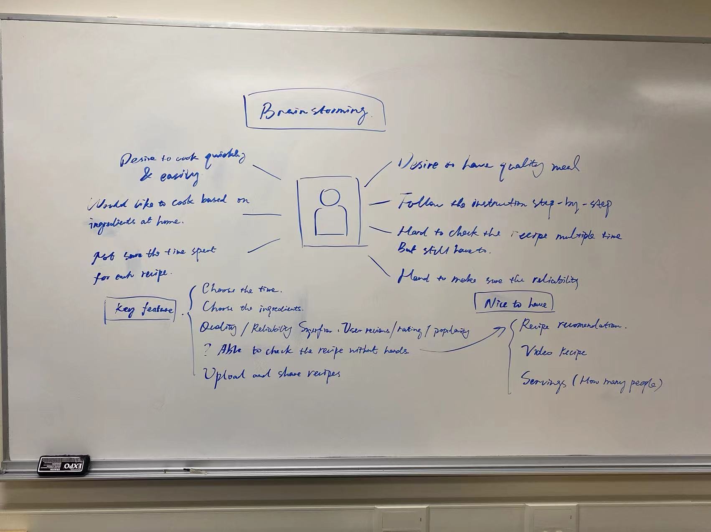

## Brainstorming Note

## Revisions to Prior Work
We made some changes on the discovery-and-planning.md of our milestone 2 submission based on the instructor's feedback, below outlined all changes to our prior work.

### 1. Who are your users? 
Feedback: You have a good start here. However, based on the users you interviewed (which on their problems and needs, you based your app's focus), the target user description is too broad and should be more specific and aligned with the user group you focused on. According to that description, you should have interviewed users from different age groups, at different locations and cultures, with various professions and careers, etc. 

Revision: Our users are people with limited time for cooking and need help on dealing with the ingredients left in their frige, like college students and officer workers that are busing on working / studying or have tight schedules, to help them make food easier and faster.

### 2. Interview - What methods you used and why the methods are good choices
Feedback: you didn't explain why you chose to conduct field studies with six users. Did you do them before the semi-structured interviews? Where did they take place? What was the procedure of the field study?

Revision: We noticed that our methodologies are semi-structured interviews and contextual studies. Since our contextual interview has a session to let people stimulate how they interact with recipes, we design them as field strides. We add the procedure and how we decide the six contextual interviews in the new version.

### 3. Interview - Provide a brief summary of each user and what you learned from them.
Feedback: you only did partial work here. You indicated you conducted 15 interviews, you included a summary of only six of them, what about the rest? What about the main findings from the six field studies?

Revision:  we add main findinds under the user interview section for each of the six field studies.

### 4. Problem identification
Feedback: you didn't indicated which one or two key problems you are planning on focusing on.

Revision:
we choosed to focus on the first two problems we identified.

- **It's hard to find the recipe that exactly match the ingredients that the user wants. (The problem we are planning on focusing on)**

- **It's hard to find recipes that can be finished within a desired time period. (The problem we are planning on focusing on)**

### 5. Value Propositions
Feedback: Only one value proposition? You could have come up with a few more.

Revision: 

### 6. Scenarios
Feedback: your scenarios should describe the user while he/she performed the task (not just what task he plans to do). Also, it is good to include a description of what happens after the user performs the task, how do they feel, what are their thoughts.

Revision: added description of how user performs the task as well as his/her thoughts on this app. 

## Persuasive Design

## Rationale
Our app name is Facipe. It's main users are those who have limited time in cooking and want to make the best use of the ingredients that they already have. We choose these audience based on our interviews with the users where we learned that people want to find a recipe based on existing ingredients. Moreover, people want step-by-step instructions with visual presentations. They hope that they can know how much time a recipe will take so that they can better manage their schedules. That's why we create Facipe which provides thorough step-by-step recipes to help users make delicious dishes. Each dish is labelled with estimated time and tastes. Users can also see the comments and people's ratings. Let's take a closer look at the scenarios and how our product resolves users' pain points.

Jason needs a quick dinner that can be prepared within 15 minutes using what he has in his fridge. By clicking the "Quick Meal" button on the app, Jason can use the slide bar and tell the app how much time he has. Facipe can filter the recipes that takes less than 15 minutes for Jason. Jason can also click the ingredients he has in the filter. All the recipes are provided with photos on the browsing page. The photos are labelled with estimated time on their upper left corner. Jason can look at the rating and pictures to decide which one he wants. He can click a recipe to go to the details page. In the details page, he can see a step-by-step instruction which allows him to prepare his food in a given time frame using what he already has in his fridge.

Amy likes to explore new recipes. She can tap the "Trending" button in the app to see the highly-rated recipes. She can save a recipe she likes for later use. By clicking the "Saved" button, she can see what she has saved and refer to them for cooking. Amy cares about the taste of food, and she can actually see the taste such as "spicy" when she browses the app. She can also see what type of cuisine it is, such as "Asian".