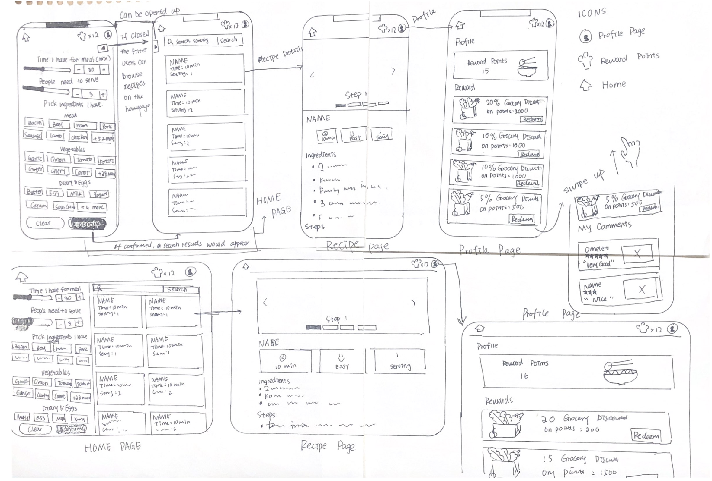

# Milestone3 Design

Main content:

- Brainstorming Note
- Revisions to Prior Work
- Design sketches and rationale
- Persuasive desgin and rationale (11.15 revision)

## Brainstorming Note

we brainstorm the main features of our app and how it meet user requirements

## Revisions to Prior Work

We made some changes on the discovery-and-planning.md of our milestone 2 submission based on the instructor's feedback, below outlined all changes to our prior work.

### 1. Who are your users?

Feedback: You have a good start here. However, based on the users you interviewed (which on their problems and needs, you based your app's focus), the target user description is too broad and should be more specific and aligned with the user group you focused on. According to that description, you should have interviewed users from different age groups, at different locations and cultures, with various professions and careers, etc.

Revision: Our users are people with limited time for cooking and need help on dealing with the ingredients left in their frige, like college students and officer workers that are busing on working / studying or have tight schedules, to help them make food easier and faster.

### 2. Interview - What methods you used and why the methods are good choices

Feedback: you didn't explain why you chose to conduct field studies with six users. Did you do them before the semi-structured interviews? Where did they take place? What was the procedure of the field study?

Revision: We noticed that our methodologies are semi-structured interviews and contextual studies. Since our contextual interview has a session to let people stimulate how they interact with recipes, we design them as field strides. We add the procedure and how we decide the six contextual interviews in the new version.

### 3. Interview - Provide a brief summary of each user and what you learned from them.

Feedback: you only did partial work here. You indicated you conducted 15 interviews, you included a summary of only six of them, what about the rest? What about the main findings from the six field studies?

Revision: We noticed that our methodologies are semi-structured interviews and contextual studies. Since our contextual interview has a session to let people stimulate how they interact with recipes, we design them as field strides. For the semi-structured interview, we only had 3~4 questions, and many of them didn’t cook. We add the main findings of 6 contextual interviews and semi-structured interviews under the user interview section for each of the six field studies.

### 4. Problem identification

Feedback: you didn't indicated which one or two key problems you are planning on focusing on.

Revision:
we choosed to focus on the first two problems we identified.

- **It's hard to find the recipe that exactly match the ingredients that the user wants. (The problem we are planning on focusing on)**

- **It's hard to find recipes that can be finished within a desired time period. (The problem we are planning on focusing on)**

- Users don't know the health information (like calories, nutrient content, etc.) of the recipe.

- Users don't want to check their devices multiple times when they are cooking.

- Some recipes don't have clear instructions on the dosage needed for the seasoning / sauce.

- Recipes can't be visually presented in a step-by-step way.

- Bad recipes may hurt the users' experience.

we choosed to focus on the first two problems we identified.

### 5. Value Propositions

Feedback: Only one value proposition? You could have come up with a few more.

Revision: Reworked the propositions by coming up with a more thorough one. Focuses more on how our apps solves the users' pain points.

### 6. Scenarios

Feedback: your scenarios should describe the user while he/she performed the task (not just what task he plans to do). Also, it is good to include a description of what happens after the user performs the task, how do they feel, what are their thoughts.

Revision: added description of how user performs the task as well as his/her thoughts on this app.

## Persuasive Design

People might be too lazy to cook and just order food instead (usually junk/fast food so it's not good for their health) because they have tight schedules or just don’t want to spend too much time on cooking, also maybe they have no idea what to do when they see the messy ingredients left in their fridge.

So our application is going to make the user feel that cooking could be simple and fast, and it’s easy to utilize the ingredients left in their fridge so they would be more willing to cook by themselves instead of ordering takeaways. and utilizing the ingredients left in the fridge would prevent wasting. Our features include the time indicator and the time filter that can easily let the user know how long they need to finish the recipe and they can pick the recipe they like in their desired time frame. The feature of searching by ingredients would let the user feel convenient to deal with the ingredients they have in their fridge so they would not feel cooking is a burden anymore.

We are also going to create a reward system. When the users cook more often or utilize the ingredients more, they would get more points for the badge “fast cooking chief” or “expert of utilizing ingredients” to prompt the user to utilize the ingredients as much as possible and cook by themselves more instead of ordering takeaways.

## Feature List and Rationale

Our app name is Facipe. It's main users are those who have limited time in cooking and want to make the best use of the ingredients that they already have. We choose these audience based on our interviews with the users where we learned that people want to find a recipe based on existing ingredients. Moreover, people want step-by-step instructions with visual presentations. They hope that they can know how much time a recipe will take so that they can better manage their schedules. That's why we create Facipe which provides thorough step-by-step recipes to help users make delicious dishes. Each dish is labelled with estimated time and tastes. Users can also see the comments and people's ratings. Let's take a closer look at the scenarios and how our product resolves users' pain points.

Jason needs a quick dinner that can be prepared within 15 minutes using what he has in his fridge. By clicking the "Quick Meal" button on the app, Jason can use the slide bar and tell the app how much time he has. Facipe can filter the recipes that takes less than 15 minutes for Jason. Jason can also click the ingredients he has in the filter. All the recipes are provided with photos on the browsing page. The photos are labelled with estimated time on their upper left corner. Jason can look at the rating and pictures to decide which one he wants. He can click a recipe to go to the details page. In the details page, he can see a step-by-step instruction which allows him to prepare his food in a given time frame using what he already has in his fridge.

Amy likes to explore new recipes. She can tap the "Trending" button in the app to see the highly-rated recipes. She can save a recipe she likes for later use. By clicking the "Saved" button, she can see what she has saved and refer to them for cooking. Amy cares about the taste of food, and she can actually see the taste such as "spicy" when she browses the app. She can also see what type of cuisine it is, such as "Asian".

#### Two sliders (11.15 revision)

One slider is "Time I have for the meal (minutes)". The other one is the number of people to serve. There is a control on the right side of the slider where users can click plus or minus.
Rationale: We use sliders so that users can directly drag it and it is easier for them to know the range of time requirements in our app. We add controllers to cater for different users' preferences.

#### Checkboxes for ingredients (11.15 revision)

We categorized the ingredients into "Meat", "Vegetables", "Diary & Eggs", and "Spice & Herbs". Users can click on checkboxes and select one or more ingredients they have in their refridgerator.
Rationale: Our interviewee Jason wants to utilize what he has in his fridge. These checkboxes allow users to select what they already have quickly without typing. We categorize them so that it is easy for users to find the ingredients in our checkboxes.

#### Search function: "Clear" and "Confirm" buttons (11.15 revision)

A click on the "Clear" button will set every checkbox for ingredients into "unchecked".
Rationale: There are many checkboxes and it is time-consuming to uncheck all of them by hand. A "Clear" button is efficient and cater for the needs for our busy users that want to save time using our app.

A click on the "Confirm" button will trigger the search function in our app. The recipe cards on the right will be filtered and only those that fits in the time range, can serve more people than required, and contain the ingredients that users input will be displayed.
Rationale: Our users want to figure out what they can cook with the ingredients they have and in the time range they have.

#### Search box (11.15 revision)

Users can also type in the search input field if tehy have something in mind. After "Enter" or click "Search", The search box can match the name of the recipe.
Rationale: Sometimes users have something specific in mind and they want to directly input the name of the cuisine.

#### Recipe Card (11.15 revision)

Recipe cards show the name of the recipe, the photos, the required time, and how many people it can serve. Clicking on the recipe card will redirect the users to the recipe details page.
Rationale: Users want to know the required time, how many people it can serve, and the overal quality of it. A picture as a background of the recipe card can give users a rough idea about what this dish is about. This saves time for users.

#### Recipe Details Page: Photo Gallery (11.15 revision)

A photo gallery on top of the recipe details page. Users can click the left arrow or right arrow to navigate through these photos. There is an overview photo and several photos matching each step of the recipe.
Rationale: Users want to see pictures of each step.

#### Recipe Details Page: Basic Info - Name, Time, Difficulty, People to Serve, Ratings (11.15 revision)

We show the name of the recipe, time to cook, difficulties, people to serve, and the rating to inform users about the recipes.
Rationale: People want to know how difficult it is to decide whether they can handle it or not. Users want to know the rating so that they can judge how good a recipe is.

#### Recipe Details Page: Ingredients and Steps (11.15 revision)

We show the name of the recipe, time to cook, difficulties, people to serve, and the rating to inform users about the recipes.
Rationale: Users want the app to explicitly show what ingredients they need so that they know what to prepare. Detailed steps help them cook better.

## Final Sketch

