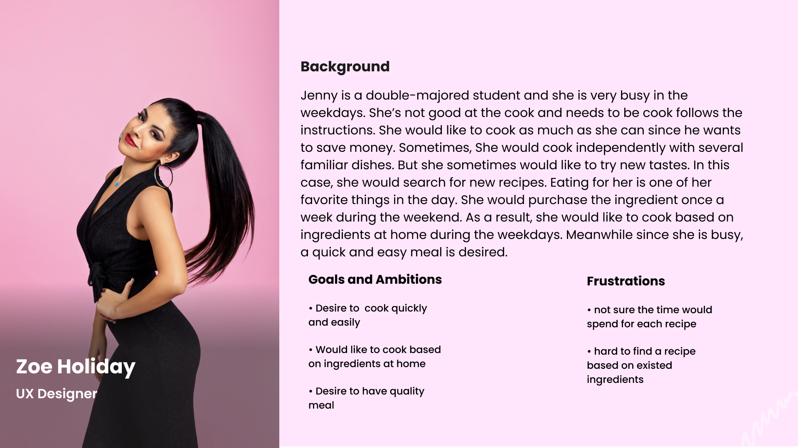

# Milestone 2 Discovery & Planning

Main content:

- Users
- Gathering Information by interviews
- Affinity Diagram from interviews
- Problem identified
- Value Propositions
- Scenarios
- Personas
- Project Themes

## Users of the Product

Our users are people with limited time for cooking and need help on dealing with the ingredients left in their fridge, like college students and office workers that are busy working/studying or have tight schedules, to help them make food fast and easy.

## Gathering Information

### - Methodologies:

We conducted 15 semi-structured interviews and seven contextual interviews with several follow-up questions. According to our contextual interview and part of the semi-structured interviews, we showed an affinity diagram accordingly. We chose the seven users from the 15 semi-structured interviews. We continued to do the contextual interview with those willing to participate in the field studies and who have used the recipe needs. We asked them several questions in the contextual interviews and simulated how they would typically interact with the recipe at their home.

Semi-structured interviews can enable us to find a significant number of insights in a short period of time. At the same time, they allow the interviewees to give open-ended responses to gain more in-depth information. After refining the goal, using contextual interviews enables us to gain focused insights. They enable us to observe the details about the interaction between participants and the target objects. And since participants would be in a familiar environment, they tend to relax and be authentic. Also, in-depth questions enable us to gain real insights.

### - Users interviewed:

1. Miss. Cao is a 21-year-old undergrad student at Cornell University, she lives in the students' dorm and cooks occasionally. Also, she is at an intermediate level on cooking so she checks recipes a lot (by using recipe application). As a student, she is kind of busy with school work and doesn't have much spare time on cooking so she really wants to cook fast but also wants the food to taste good. She wants some more convenient cooking methods because she doesn't have an oven in her dorm. Plus, she is not an experienced cook and it's hard for her to catch the instruction of the recipe sometimes so she wonders there's some sort of instructions that can lead her for the whole process, just like the videos that teach people doing the exercise, we can follow it for the whole process.
   Main findings: interviewees tend to find a recipe that is quick and easy when time is limited. The interviewee prefers a visual demonstration of the step-by-step cooking process.

2. Miss. Chen is a 21 years old student at PSU and she cooks frequently about 4-5 days a week, she is an experienced cook and has been cooking for 4 years, she also uses recipes (recipe application) very often because she likes to explorer new dishes. One thing that concerns her is how to deal with the ingredients left after each meal because she wants to utilize them but she doesn't know how to cook only using those ingredients. She also mentioned that she has the need to finish the meal fast or in a specific time period because sometimes she has limited time for cooking. Plus, she has the desire to keep her body weight so she wants to know the calories or some more nutrient information of the ingredients. Another issue she talked about is about switching hands while cooking using recipe applications because when she has done a part of the instruction, she needs to switch to her phone and see what's the next step in a hurry. Her hands always made the phone dirty and oily during the process and made her feel uncomfortable.
   Main findings: interviewee likes to use recipe applications to explore new dishes. The interviewee tends to find a recipe that is quick and easy when time is limited. Interviewees don't like to interact with the mobile app too often with their hands during cooking.

3. Interviewee Mr. Liang is a 23-year-old graduate student at Cornell University. He cooks 4~5 times per week. He spends about 5 hours per week cooking. He cooks based both on his knowledge and something new he learned online (not necessarily from recipe apps). He enjoys making cakes and would like to learn recipes online for cakes. He does not care about how much time he spends on making cakes, but for recipes other than those for cakes, he wants them to be time-saving. He enjoys searching for cake recipes that both look nice and taste delicious. He will carefully read the recipe and see if it seems delicious to him or not. He will only follow the recipes with great reviews. He doesn’t check the recipe when he is cooking because he does not think it is convenient. He thinks that even if he uses the recipe, he may still fail to make cakes because sometimes it is hard to control the number of ingredients he puts.
   Main findings: Interviewees use recipe app to learn to make desserts. The interviewee tends to find a recipe that is quick and easy when time is limited. the interviewee will look at the recipe review section to determine if a recipe is worth trying. The interviewee prefers to know the exact dosage of the seasonings or sauces rather than 'a little or 'proper amount'.

4. Interviewee Mr. Li is a 19-year-old undergraduate student at UCSD. He spends 15 hours a week cooking. He looks at recipes not only when he is cooking, but also he looks at them when he is free. He looks at what he has in the refrigerator then decides what he will cook. He does not use a specific recipe app. Instead, he likes to watch videos on YouTube about how to cook something. He watches those videos for fun. He prefers to watch long videos (like those on youtube) than short videos (like those on Tiktok) for recipes. Although he is a big fan of Youtube, he says that Youtube is not a perfect place for learning new recipes because he needs to search on his own. He will not review the videos when cooking because he thinks that it's not convenient. He prefers those recipe videos on youtube that are concrete and clear about each step. He also likes to look at visualized recipes. He will read the recipes many times before he starts cooking. He will avoid looking at the recipe again and again when he is cooking but will check it again if he needs to. On Sundays, he may cook a great amount of food for the next week to save time.
   Main findings: Interviewees prefer to watch a lively video or use a recipe with more visual content. Interviewees don't like to check their devices multiple times during cooking. the interviewee might cook excessive food to eat in separate meals to save time.

5. Mr. Fan is a 22 yrs old master student at Cornell University, he lives alone in an apartment and usually cooks 6- 7 times a week. He admits he is not good at cooking and he has to rely on a recipe to prepare a meal. He loves to spend sparse time watching short videos, so as he prefers having visual presentations on the cooking procedure, e.g. short cooking videos, photos, etc. He usually spends less than 15min preparing a meal, most of the cases are cooking some pre-made instant food. He has a strong desire to find some simple and tasty recipes that are tailored for students or working-class who don't want to spend too much time on cooking but still want to remain healthy.
   Main findings: interviewee prefers to watch lively videos or use a recipe with more visual content. The interviewee tends to find a recipe that is quick and easy when time is limited. The interviewee cares about food quality and nutrition.

6. Mr. Li is a 25 yrs old software engineer, he lives alone in an apartment and usually cooks 7 times a week. He is an intermediate cooker. He loves to spend sparse time finding new tastes and recipes. Meanwhile, he is busy at work. Sp during the weekdays, he prefers to cook a quick and easy meal with existing ingredients. And explore more tastes during the weekend.
   Main findings: interviewee prefers to cook a quick and easy meal with existing ingredients especially during weekdays.

7. Diamond is a 39-year-old Uber driver. I interviewed him in the taxi. He cooks every day for his family. She is married with two daughters. He cooks for 20 hours or so. Most of the time he cooks based on his knowledge. Recently he is preparing for his daughter's birthday and would like to learn something new using online recipes. He used the app Chunky Chef. He found it useful and thorough but took too much time to read. He also wants to save money and would like to directly input what ingredients he has got in his fridge.
   Main findings: interviewee wants to save money by utilizing what he already has in his fridge instead of buying something new.

8. Miss. Olivia is a 24 years old UX Researcher and has worked for 2 years. She spends about 5 hours a week cooking and she thinks she is at an intermediate level. She usually prepares the food 1 day prior to working and she tends to cook easy and low-calorie food. She is willing to discover new recipes but she tends to investigate more on the recipes about how other peoples think so she would like to know how other people like the recipe. Also, she is a bit tired of the recipe applications nowadays with too many unnecessary features and buttons that cost her extra time to check what she really needs, she just wants it simple and works fast. 
   Main findings: interviewee wants to know more about how other people think about the recipes online and wants a simple and easy-to-use application without too many unnecessary features and buttons.

Link to the detailed [Interview Notes](./interview-notes.md)

### The key takeaways from contextual interviews:

- People desire for finding a recipe based on existing ingredients

- People tend to find a recipe that is quick and easy when time is limited

- People don't like to check their devices (mostly mobile phones) multiple times and desire for keeping the phone safe and clean

- People prefer step-by-step instruction with visual presentations

- People are willing to explore new tastes by trying out recipe app

- Many people want to make the most of the ingredients they have.

- Many recipes online require too many ingredients and take too much time.

- People prefer to know the exact dosage of the seasonings or sauces rather than 'a little or 'proper amount'.

- People would like to have the instruction for the whole process that can be followed.
- User will look at the recipe review section to determine if a recipe is worth trying.
### Semi-structured interview
(Nov 28 revision)
We conducted 15 quick semi-structured interviews and we only recorded the information related to our topic.

#1 He is an ECE grad student who learned to cook from his roommate. He never tried to install a recipe app, but he is willing to try if there are some special recipes on it.

#2 She is a busy student who rarely cooks, but if a recipe can advise her how to cook in a faster manner, she is more than willing to try it out.

#3 She cooks frequently, she usually looks at google search results and sometimes checks youtube video tutorial, she prefers video content to pure text, and image contents are also preferable.

#4 He is a super busy student and would like to cook extremely easy meals without recipes, such as a sandwich or frozen dumplings.

#5 He is a senior student in information science and desires recipes for a quick and easy meal. He often goes to Phillips hall to buy easy-cooked food. If a recipe app provides a feature of searching fast recipes, he is willing to try them out.

#6 He is a frequent recipe user, and he is on diet, he usually looks for low-calorie food. 

#7 She is a busy student who doesn’t cook, she might not install a recipe app, she thinks canteen and restaurants are sufficient. 

#8 He is a regular recipe user, he also has leftover ingredients in the fridge, so he prefers a way to help him minimize the chance of fresh food and vegetable expiring before they get cooked.

#9 She cooks almost every day and wants to make the meal taste good, at the same time can be easily prepared.

#10 He never cooked, so he has no demand for a recipe app.

#11 She uses social media to explore good meals such as youtube videos and TikTok. She is interested in making this food by herself.

#12 He rarely cooks, he tried out new recipes only once or twice found in google search, and he thinks he doesn't need a recipe app. 

#13 She learns to cook from her mom and she already knows a lot of recipes, so she doesn't rely on any recipe app.

#14 He recently start cooking by himself and he really lacks any recipe, so a recipe app would be a great help.

#15 She rarely cooks, so he has no demand for a recipe app.

### The key takeaways from semi-structured interviews:
(Nov 28 revision)
During the semi-structured interviews, we found over 30% of the interviewers rarely cook and might not use a recipe app. Some of them are willing to install a recipe app if it provides certain features. The rest of the interviewers desire recipes that can save their time, either from their friends or online resources.

- People want to make quick meals, especially in the prelim seasons

- A handy recipe app would be preferable

- People would search for help from friends or online search

- People would typically go shopping for ingredients once a week and would choose to cook whatever they have

### Affinity Diagram:
This is the affinity diagram we concluded from our semi-structured interviews and contextual interviews.

## Problems Identified 
(Oct20 revision)

- **It's hard to find the recipe that exactly matches the ingredients that the user wants. (The problem we are planning on focusing on)**

- **It's hard to find recipes that can be finished within the desired time period. (The problem we are planning on focusing on)**

- Users don't know the health information (like calories, nutrient content, etc.) of the recipe.

- Users don't want to check their devices multiple times when they are cooking.

- Some recipes don't have clear instructions on the dosage needed for the seasoning / sauce.

- Recipes can't be visually presented in a step-by-step way.

- Bad recipes may hurt the users' experience.

we chose to focus on the first two problems we identified.

## Value Propositions

Our app(Facipe) enriches people's life by providing high-quality recipes that make the most of their limited time and ingredients. Facipe tells users the possible dishes they can make in a given amount of time. Users can know how to save money and prevent wasting food by entering what they have as ingredients. By providing step-by-step instructions visually, Facipe helps users cook better.

## Scenarios (11.16 revision)

Jason is a lawyer who enjoys cooking in his own place but he has a tight time schedule. He has a meeting scheduled at 8 pm, and he would like to make a quick dinner using some available ingredients so that he can save his time. Jason goes to our Facipe app for the first time today and is awarded one point. This motivates him to come to Facipe again tomorrow. Jason has 15 minutes before going to work and he has got chicken, beef, tomato, and egg in his refrigerator. He clicks the “Confirm” button and can see three recipes out there. He can see four recipes that satisfy his needs. They are Burger, Pasta with Tomato Sauce, Creamy Tomato Soup, and Omelets. He picks Omelet because it seems the most convenient one. Jason can also type in the search input field if he has something in mind. For example, Jason can type “Omelet” and the filter is applied. Jason clicks the recipe card and is redirected to the recipe details page. He sees the detailed steps with nice pictures and follows them to make a delicious meal. Our Facipe app helps Jason save time.

Amy is a double-majored student at Cornell University and she is super busy on weekdays. She cooks nearly every day and she loves to share her dishes. Yesterday she just used up most of the major ingredients and she woke up a bit late today so she doesn't have time to prepare food but just using the stuff left in her fridge. She doesn't have time to open her laptop so she opens up Facipe app on her phone (it's a responsive application so it fully supports mobile devices). She slides the time bar to 15 minutes and 1 person to serve and selected what she has in her fridge: beef, onion, and potatoes. She can see several recipes and she chooses the beef burger. After she followed the instructions and finished the recipe, she feels the burger is easy to cook and taste really good so she taps the share button and leaves a comment with a photo of what she made, she can even earn a reward by sharing the comment with pictures.
## Persona

First Persona

Second Persona

## Project Themes

1. A dynamic panel that can input the time and people desired by the user and gives the user a list of selections for the ingredients they have.
2. An Attractive recipe gallery with cooking time.
3. A search bar for users to search for the dishes they want.
4. Recipe detail pages with step-by-step instructions and everything the user needs to know to cook.
5. Sharing feature for users to share feedback and earn reward points (persuasive design).
6. A personal profile page to check what users could earn with the reward points and their comments.