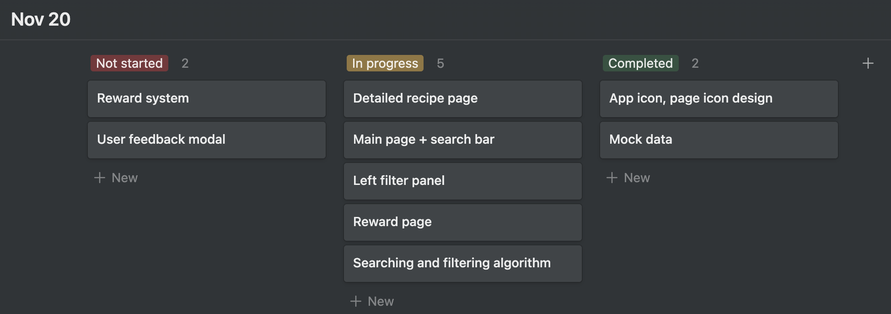

# Milestone 4: High-Fidelity Prototype

Main content:

- Revisions to Prior Work
- Development schedule

## Revisions to Prior Work

- Feedback from milestone 3 are incorporated in the design.md, including adding design details on each feature, and the rationale behind.
- Added captions for sketches and complement brainstorm note.
- Increased mock data to 10 recipes.
- Improved responsive display for filter panel and card component in the main page.
- The trending button in our original design is not related to our user scenario which is to make quick and easy meal, so we removed this feature.
- Rewarded users cash points for their first login of a day, and reward points for posting recipe feedback, display the total reward points in the top-right corner of the header bar. These adjustments are our persuasive design that aim to increase user incentive to interact with the app more often.

## Development Schedule

Sample of our development tracking diagram

DUE Features and implementation

Nov 14 sprint backlogs 1
design landing pages for both mac and mobiles - Sonia
design reward system - Sonia
write json files - Sonia
search page to recipe page routing + search page cards - Yangkai
implement search page components - Jieyu
implement recipe page - Jieyu
beautify the app with css - Yingshi
implement reward system - Yingshi

Nov 20 sprint backlogs 2
mobile page - Yingshi
search function left - Jieyu
search function right - Yangkai
routing - Yangkai
feedback - Yingshi
clearAll button - Jieyu
modify documentations, sketches - ALl

Nov 25 - Merge all pages and add router, ensure basic functionality

Nov 30 - Add comment and reward feature

Dec 3 - Finalize App UI

Dec 7 - Presentation

Dec 16 - Revision based on feedback, minor tweak
